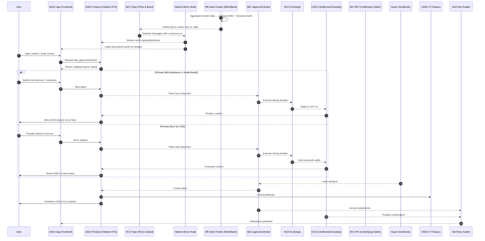
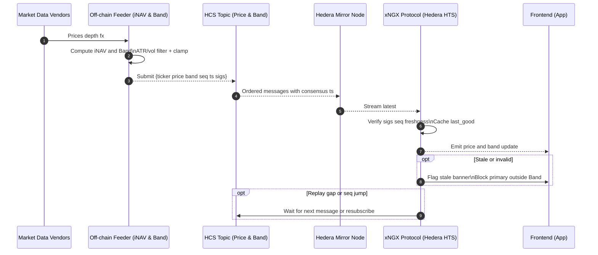
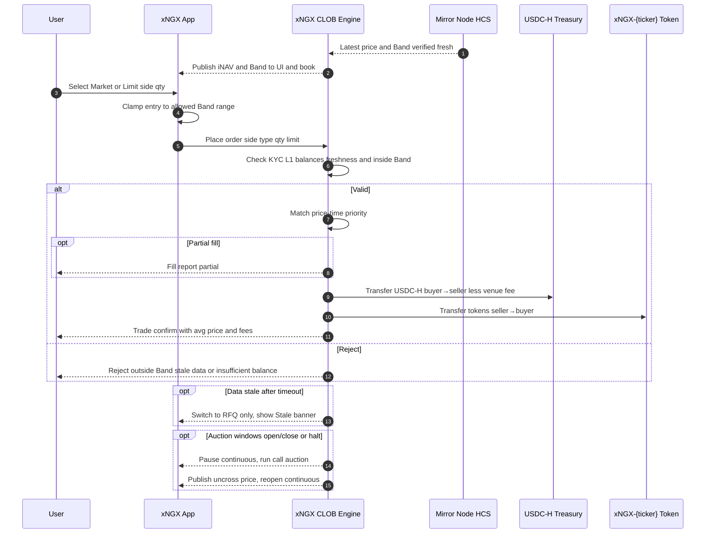
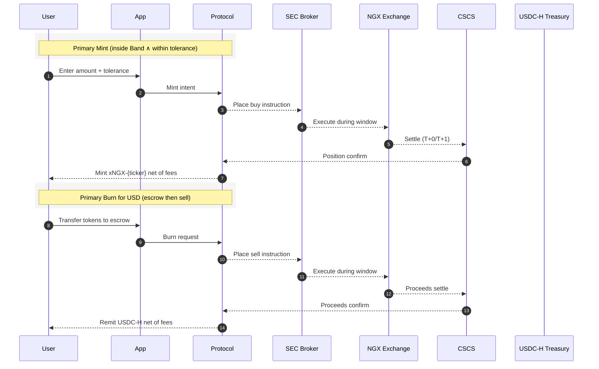
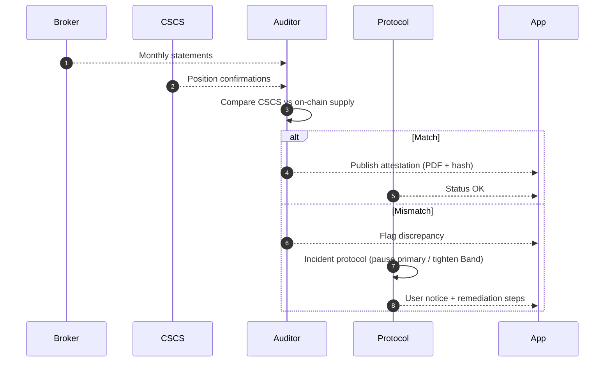
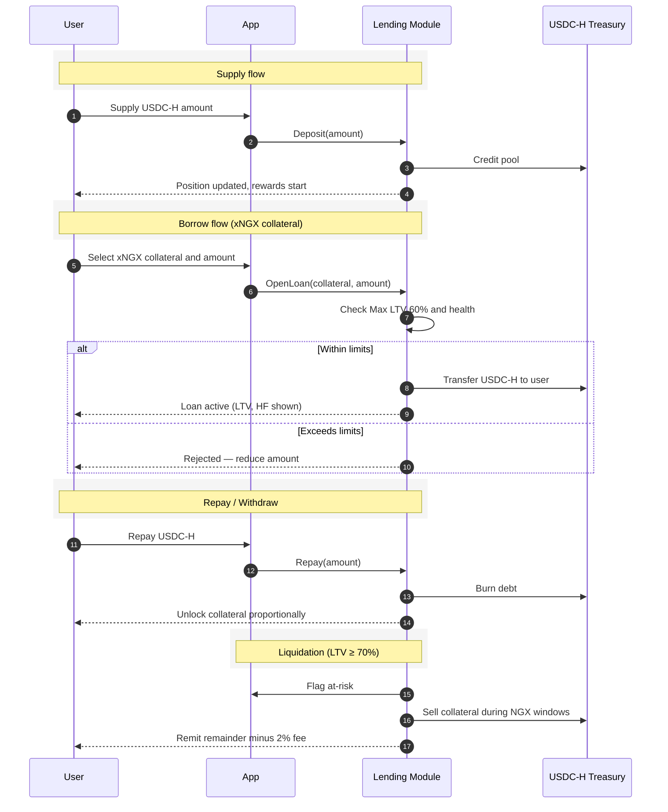

# xNG.markets — Whitepaper (Markdown v0.3)

**Regulated, on‑chain exposure to NGX blue chips via Hedera**  

---

**Date:** 12 August 2025  
**Status:** Draft for Legal, Broker & Auditor review  

## Table of Contents

1. [Abstract](#abstract)
2. [Introduction & Market Context](#introduction--market-context)
3. [Market Opportunity & Why Now](#market-opportunity--why-now)
4. [Product Overview](#product-overview)
5. [System Architecture (Hedera‑first)](#system-architecture-hedera-first)
6. [Market Data: Price, iNAV & Dynamic Band](#market-data-price-inav--dynamic-band)
7. [Trading Mechanics](#trading-mechanics)

   * [Secondary CLOB Trading](#secondary-clob-trading)
   * [Primary Mint](#primary-mint)
   * [Primary Burn for USD](#primary-burn-for-usd)
   * [Claim Shares (Level‑2; later)](#claim-shares-level2-later)
8. [Fees](#fees)
9. [Dividends](#dividends)
10. [KYC/AML & Eligibility](#kycaml--eligibility)
11. [Legal & Structure](#legal--structure)
12. [Proof‑of‑Reserves & Attestations](#proof-of-reserves--attestations)
13. [Borrow & Supply (Lending)](#borrow--supply-lending)
14. [Security, Audits & Operations](#security-audits--operations)
15. [Governance & Upgradability](#governance--upgradability)
16. [Roadmap](#roadmap)
17. [Risks](#risks)
18. [Appendices](#appendices)

## Abstract

xNG.markets mirrors select NGX equities as Hedera Token Service (HTS) assets (`xNGX-{ticker}`) with prices and guardrails (**Dynamic Band**) published on‑chain via Hedera Consensus Service (HCS). Users trade via a **Secondary CLOB** and **Primary Mint/Burn** windows synchronized with NGX market hours and routed to a Nigerian **SEC‑approved broker**. Underlying shares are held at **CSCS** via a **BVI SPV**. Dividends are distributed to token holders in **USDC‑H (USD)**. A monthly **Proof‑of‑Reserves** (PoR) compares off‑chain CSCS holdings to on‑chain supply through independent attestation. **KYC Level‑1** enables trading; **Level‑2** with the broker/CSCS is only required for the later **Claim Shares** feature.

## Introduction & Market Context

Nigeria’s equity market is expanding in depth and participation across banks, telecoms, energy, consumer and agriculture. xNG.markets lowers access frictions by offering 24/7 order entry with transparent on‑chain guardrails and regulated primary flows that settle through a licensed broker and CSCS custody.

## Market Opportunity & Why Now

* Elevated turnover and improving depth; growing retail and returning foreign flows.
* Dividend culture among banks/blue‑chips; USD distribution simplifies receipt for local and diaspora holders.
* Reform tailwinds (e.g., bank recapitalisation through 2026).
* Diaspora remittances are large; tokenized NGX exposure removes onboarding and rail frictions.
* On‑chain delivery adds transparency (HCS + PoR), fractional access, composability (collateralized borrowing), and programmable distribution.

## Product Overview

* **Form:** HTS tokens with KYC flag; naming `xNGX-{ticker}`.
* **Coverage (initial):** Banking (top 10), Energy (Seplat, Total, Conoil), Consumer (Nestlé, Dangote Sugar, Flour Mills, Guinness, NB), Agriculture (Okomu Oil, Presco), Insurance (AIICO, Cornerstone).
* **Trading:** Secondary **CLOB** + **Primary Windows** (Mint/Burn).
* **Dividends:** Converted and distributed in **USDC‑H (USD)**.
* **Compliance:** **Level‑1 KYC** for trading; **Level‑2** only for **Claim Shares** (disabled at launch).

## System Architecture (Hedera‑first)



**Sequence overview**

* **Data publication.** The Feeder aggregates market data and publishes signed iNAV and Dynamic Band updates to Hedera Consensus Service (HCS).
* **Data consumption.** The Protocol and UI retrieve updates via the Mirror Node and verify signatures, sequence, and freshness before display or use.
* **Order entry.** Investors access the application, view validated pricing, and submit orders.
* **Primary routing.** Primary flows route to the SEC‑approved broker for execution on NGX during market windows.
* **Settlement and custody.** NGX trades settle at CSCS; the BVI SPV holds the underlying shares.
* **On‑chain reflection.** Following off‑chain confirmation, the Protocol mints or burns tokens to reflect positions.
* **Dividends.** Cash dividends flow from issuer to broker to the Protocol and are distributed to holders in USD.
* **Independent assurance.** An external auditor compares CSCS positions with on‑chain supply and publishes an attestation monthly.

## Market Data: Price, iNAV & Dynamic Band



**Sequence notes**

1. **Vendors → Feeder.** Approved vendors provide prices, order‑book depth, and FX data.
2. **Computation.** The Feeder calculates iNAV and a Dynamic Band (a volatility/liquidity‑aware guardrail) and signs each update.
3. **Publication.** Updates `{ticker, price, band, seq, ts, sigs}` are posted to HCS.
4. **Verification.** The Protocol/UI read via the Mirror Node, verify signatures, ordering, and freshness, and cache the last‑good values.
5. **Fallbacks.** If data is stale or out‑of‑sequence, the venue blocks primary actions outside Band and may switch to RFQ/auction until fresh data resumes.

**Illustrative example**
If MTNN iNAV = ₦280 and Band = ±1.2%, acceptable prices are ₦276.64–₦283.36. Orders outside this range are rejected until the Band or iNAV updates.

**Key points**

* Orders must be inside‑Band at entry and at match time.
* Per‑ticker clamps prevent Bands from becoming unrealistically wide or narrow.

## Trading Mechanics

### Secondary CLOB Trading



**Order book mechanics**

* **Market orders.** Execute immediately at the best available prices, subject to inside‑Band checks.
* **Limit orders.** Rest on the book until executable at the investor’s limit price or better.
* **Priority.** Price–time priority governs matching; partial fills are possible.
* **Fees.** Venue fees are charged in USD; token quantities are not clipped.
* **Resilience.** If market data becomes stale, continuous matching pauses and the venue may switch to RFQ/auction until freshness is restored.

### Primary Mint

* Inputs: **amount** and **tolerance** (max slippage vs iNAV).
* Clamp rule: `effective_tolerance = clamp(user_tolerance, −5%, +2.5%)` and must be **inside‑Band**.
* Execution: During NGX windows the broker buys underlying; Protocol mints tokens **net of fees**.
* Cancellation: Allowed while **market closed**; not cancellable once **Initiated** during open windows.

### Primary Burn for USD

* Liquidity backstop when book depth is thin.
* User transfers tokens to **escrow**; broker sells during NGX windows; Protocol remits **USDC‑H** net of fees.
* **No Level‑2/CSCS** required for Primary Burn.



**Primary flows summary**

* **Primary Mint.** Investor specifies amount and tolerance (max slippage vs iNAV). Execution proceeds only if inside the venue Band and within the investor’s tolerance. Requests are cancellable while the market is closed; once Initiated during open hours, they are no longer cancellable.
* **Primary Burn (USD).** Investor transfers tokens to escrow; the broker sells during NGX windows and the Protocol remits USD net of fees. No Level‑2/CSCS is required for Primary Burn.

**Tolerance and Band**

* **Band** is the venue‑wide guardrail around iNAV.
* **Tolerance** is investor‑selected and clamped to −5% / +2.5%.
  Both conditions must be satisfied for execution.

### Claim Shares (Level‑2; later)

Burn `xNGX-{ticker}` to receive off‑chain shares into a personal CSCS account. Requires broker + CSCS onboarding (**Level‑2**). Disabled at launch pending regulatory sign‑off.

## Fees

| Flow                 | Broker | Venue (xNG.markets) | Notes                                      |
| -------------------- | -----: | ------------------: | ------------------------------------------ |
| Primary Mint         |  0.30% |               0.10% | Charged in USDC‑H; token units not clipped |
| Primary Burn         |  0.30% |               0.10% | Remitted in USDC‑H net of fees             |
| Secondary (CLOB)     |      — |               0.20% | Per side, charged in USDC‑H                |
| Borrow (origination) |      — |               0.10% | One‑time on loan amount                    |
| Liquidation          |      — |               2.00% | Of realized proceeds                       |

*Network fees on Hedera (HTS/HCS) apply separately.*

## Dividends

Issuer → Broker → Protocol → Holders. Proceeds are converted and distributed in **USDC‑H** on a best‑effort **T+1** after issuer payment, net of taxes/withholding where applicable.

## KYC/AML & Eligibility

* **Level 0:** Browse only.
* **Level 1:** Sumsub KYC/AML → trade, mint, burn, borrow, supply.
* **Level 2:** Broker + CSCS onboarding → enables **Claim Shares** only. *(Disabled at launch.)*

Tokens are issued with an HTS **KYC flag**. Eligibility lists are maintained with counsel and enforced in‑app.

## Legal & Structure

* **BVI SPV** holds underlying NGX shares in a CSCS omnibus via the partner broker.
* Tokens provide **economic exposure only** (no voting/meeting rights).
* Terms & Risk disclosures must be accepted before trading.

## Proof‑of‑Reserves & Attestations



**Attestation outcomes**

* **Match.** Auditor confirms CSCS positions equal on‑chain supply and publishes an attestation (PDF + hash).
* **Mismatch.** Venue initiates incident procedures (tighten Band/pause primary windows as required), communicates with users, and remediates before resuming normal operations.

## Borrow & Supply (Lending)

* **Borrowers:** Post xNGX tokens as collateral; borrow **USDC‑H** up to **Max LTV 60%**; **Liquidation 70%** during NGX windows.
* **Suppliers:** Provide USDC‑H to a shared pool; earn variable APY based on utilization; rewards accrue continuously and are claimable anytime.
* **Fees:** 0.10% origination per loan; 2% on liquidation.



**Lending model summary**

* **Supply.** Lenders provide USD to a shared pool and earn variable yield based on utilization; rewards accrue continuously and may be claimed at any time.
* **Borrow.** Borrowers post xNGX tokens as collateral and may borrow up to 60% LTV; liquidations trigger at 70% LTV and execute during NGX windows. A 2% liquidation fee applies.
* **Repayment.** Borrowers may repay at any time to release collateral; health and liquidation thresholds are continuously displayed.

## Security, Audits & Operations

* Independent audits before mainnet. Admin actions protected via multi‑sig + timelock.
* HCS signatures, sequence and freshness enforced; UI shows **Stale** banners.
* Monitoring: Mirror subscriptions, PoR calendar, incident runbooks.

## Governance & Upgradability

Upgradable parameters: Band source, tolerance clamps, fee rates, supported assets — via controlled governance (multi‑sig + delay). Community signaling informs listings, subject to regulatory fit and liquidity.

## Roadmap

1. **MVP:** CLOB + Primary Mint/Burn; L1 KYC; monthly PoR; initial assets.
2. **Lending Beta:** Borrow & Supply with conservative limits.
3. **Level‑2 & Claim Shares:** After legal sign‑off.
4. **Rails:** NGN bank & mobile money on/off‑ramps (partners).
5. **Analytics:** Fundamentals, LLM chat, alerts.

## Risks

Market/liquidity, oracle/data, execution windows, regulatory change, counterparty/custody, technology and operational risks can lead to losses, delays or halts. Tokens may trade at a premium/discount to iNAV. Investors can lose all or part of their capital.

## Appendices

**A — Dynamic Band (reference)**
`band_raw = k_base + k_vol · σ_t + k_liq · (1/√depth)` → `band = clamp(band_raw, minBand, maxBand)` → `tol_eff = clamp(user_tol, −5%, +2.5%) ∧ (|Δprice| ≤ band)`.

**B — HCS message schema (price/band)**

```json
{
  "ticker": "MTNN",
  "price": 282.45,
  "band": 0.0125,
  "seq": 1234567,
  "ts": 1733740800000,
  "sigs": ["ed25519:...broker", "ed25519:...feeder"]
}
```

**C — Cancellation & windows policy**
Closed market: cancellable until open. Open (Initiated): not cancellable once funds are with broker. Weekends/holidays: queued for next window; CLOB may remain open subject to Band/staleness rules.

**D — Asset setup checklist**
Ticker, issuance (`xNGX-{ticker}`), broker routing, CSCS omnibus mapping, HCS topic IDs and signers, fee routing, disclosures and dividend pages.
**Contact:** [contact@xngx.markets](mailto:contact@xngx.markets)
**© xNG.markets 2025 — All rights reserved.**
